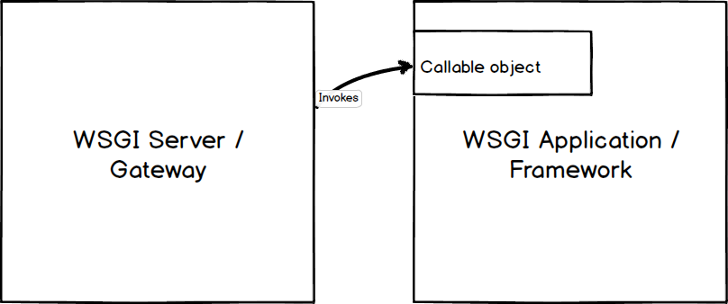
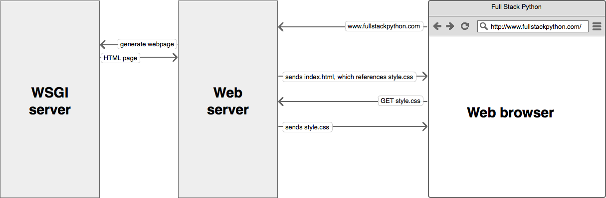

WSGI is the specification of Python. WSGI is a specification that describes how a web server communicates with the web application and how web servers can be chained to process a request. WSGI was created to standardise way to execute python code for web applications. 

The advantages of WSGI include flexibility and helps to scale. Any WSGI web application/frameworks can be easily replaced with another. Example a Django app can be replaced with Flask. The same way replacements can happen between WSGI containers. 

The working of WSGI is as follows. All request form client reaches the webserver, for example, NGINX and the web server forwards the request to the WSGI container. WSGI container invokes the callable in the WSGI application. The WSGI application then processes the request and sends back the response to the WSGI container which in turn is sent to the webserver and then back to the client.

### WSGI servers

Green Unicorn, uWSGI, mod_wsgi, CherryPy

Refs:

[https://www.youtube.com/watch?v=WqrCnVAkLIo](https://www.youtube.com/watch?v=WqrCnVAkLIo)

[https://www.digitalocean.com/community/tutorials/how-to-set-up-uwsgi-and-nginx-to-serve-python-apps-on-ubuntu-14-04](https://www.digitalocean.com/community/tutorials/how-to-set-up-uwsgi-and-nginx-to-serve-python-apps-on-ubuntu-14-04)

[https://www.fullstackpython.com/wsgi-servers.html](https://www.fullstackpython.com/wsgi-servers.html)