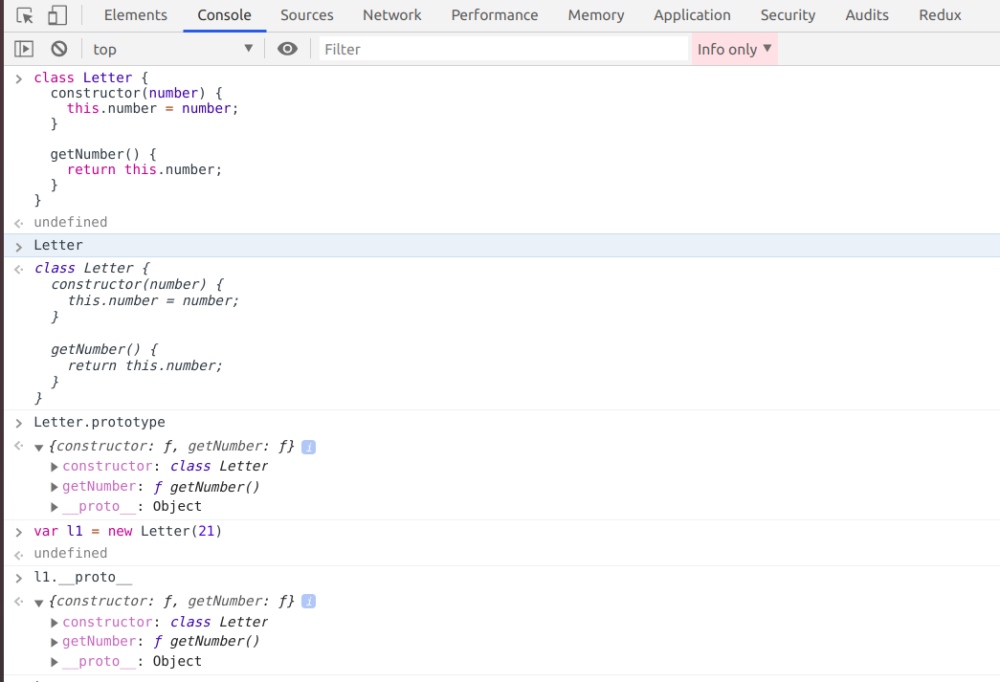
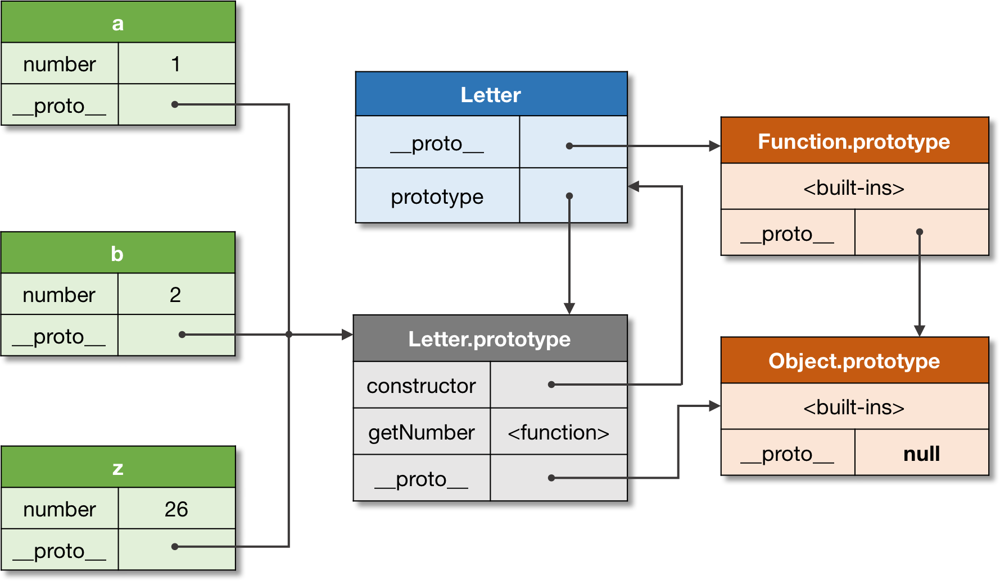
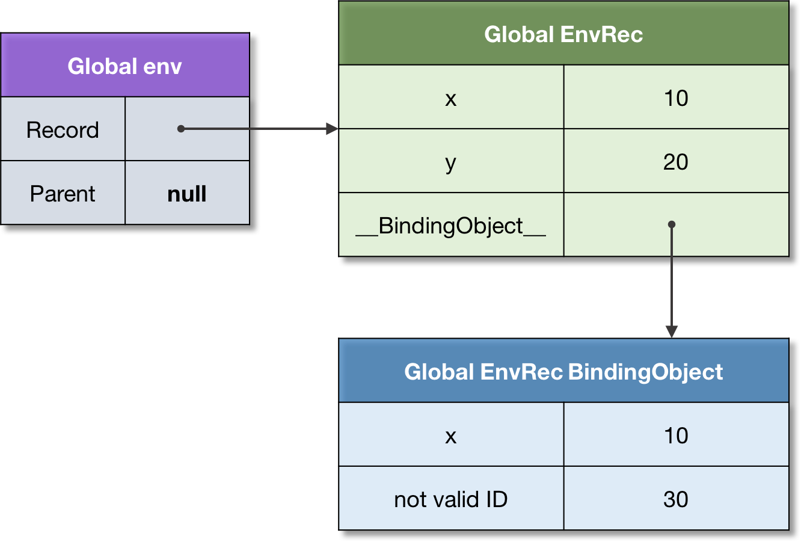
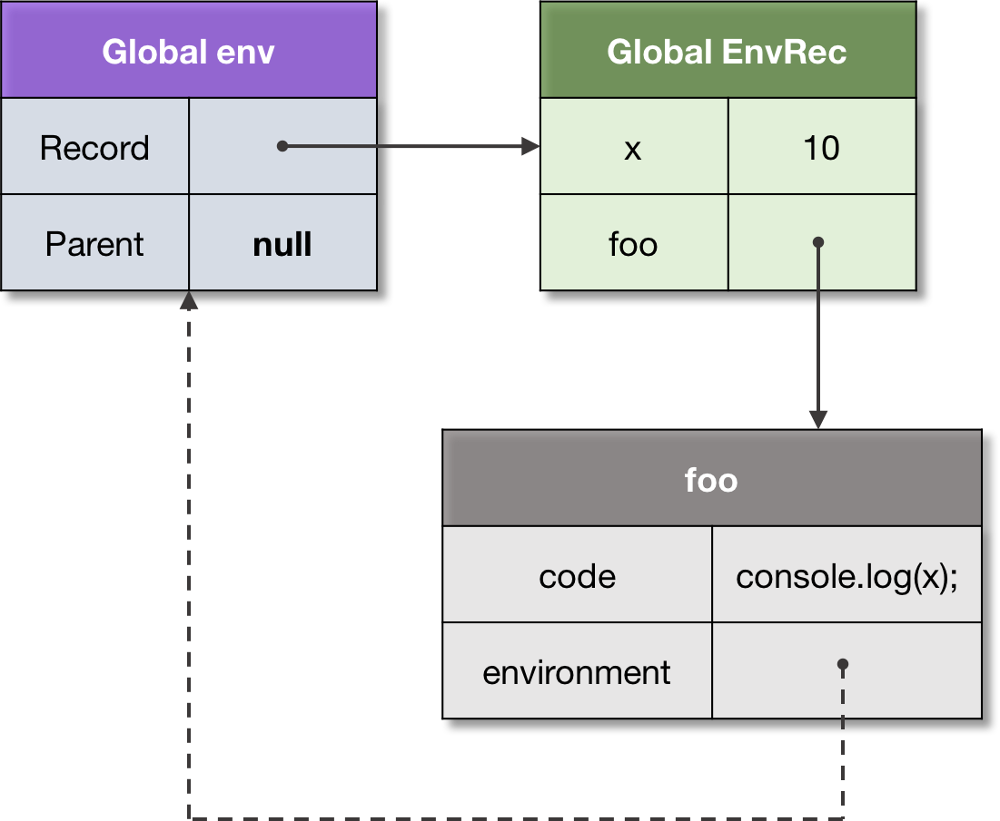

## Object

- An object is a collection of properties, with a single prototype object(can be an object or null)
- A prototype is internally [[Prototype]] and for  user-level code, it is exposed as __proto__ property of any object

## Prototype

- Object receives prototype when it is created. Defaults to Object.prototype
- Inheritance is achieved via prototype in JS object. If a property is not found the object, its prototype(__proto__) is searched until the prototype link ends in null or the value is found. Since this process happens at runtime, it is called dynamic dispatch. Also called delegation.
- The inheritance chain is completely mutable.

```jsx
let protoA = {x: 10};
let protoB = {x: 20};
 
// Same as `let objectC = {__proto__: protoA};`:
let objectC = Object.create(protoA);
console.log(objectC.x); // 10
 
// Change the delegate:
Object.setPrototypeOf(objectC, protoB);
console.log(objectC.x); // 20
```

PS:

**[[prototype]]** - the actual prototype of an object

**prototype** - a property of the constructor function, which references the object which will set a [[prototype]] of the object created using that function

**__proto__** - non standard implementation to provide reference to the internal prototype of an object

## Class

- A class is a formal abstract set which specifies initial state and behavior of its objects.
- **Class** in Javascript is just a syntactic sugar of protoype inheritace. Same behavious with a better syntax.

```jsx
**// General way of using the same object as a prototype of multiple objects**

let letter = {
  getNumber() {
    return this.number;
  }
};
 
let a = {number: 1, __proto__: letter};
let b = {number: 2, __proto__: letter};
let z = {number: 26, __proto__: letter};
 
console.log(
  a.getNumber(), // 1
  b.getNumber(), // 2
  z.getNumber(), // 26
);
```

Now we can do the same with constructor functions.

- A constructor function in JS is a normal function which when invoked with `new` operation will create an object.
- A constructor function, creates an object and sets the **__proto__** property of the newly created object to the functions prototype object.

```jsx
function Letter(number) {
  this.number = number;
}
 
Letter.prototype.getNumber = function() {
  return this.number;
};
 
let a = new Letter(1);
let b = new Letter(2);
let z = new Letter(26);
 
console.log(
  a.getNumber(), // 1
  b.getNumber(), // 2
  z.getNumber(), // 26
);
```

Now the same with **class**

```jsx
**// achieving the same behavior above with class**

class Letter {
  constructor(number) {
    this.number = number;
  }
 
  getNumber() {
    return this.number;
  }
}
 
let a = new Letter(1);
let b = new Letter(2);
// ...
let z = new Letter(26);
 
console.log(
  a.getNumber(), // 1
  b.getNumber(), // 2
  z.getNumber(), // 26
);
```

- A class can be considered as a combination of prototype object and the constructor function.

If you just print the prototype links, you can find that the `getNumber` function is added to the prototype of Letter and that prototype is assigned to the `__proto__` of all the newly created object with the class



To get visual representation, check the links in the image



## Execution context

An execution context is a specification device that is used to track the runtime evaluation of the code. Usually execution context is maintained in a stack. An execution context stack will always have **global context** initially, on will other execution contexts will b added.

Usually, an execution context will be removed once the execution is completed. An exception to this is the generator functions, which will pass the execution in the middle and get removed from the stack. Later when the execution continues, it gets pushed to stack again.


## Environment

Every execution context has an associated lexical environment. A lexical environment is a place where all the associations between identifiers and their values are stored and made available to the environment. Each environment has options reference to the parent environment. So an environment is a storage of variables, functions, and classes defined in scope.

To understand with a code

```jsx
let x = 10;
let y = 20;
 
function foo(z) {
  let x = 100;
  return x + y + z;
}
 
foo(30); // 150
```

In this two environments are there, one is **global** environment and the other one if **foo** environment. 


Since there is a link between the environment from child to parent, the identifier resolution work similarly to prototype delegation. Which means, when an identifier is not found in the execution environment, it is searched in its parent, and then its parent until found or reach the end(global).

### Binding Object

A global environment has an associated binding object. The biding object may store some properties from the record, but not the others, and vice-versa.

```jsx
// Legacy variables using `var`.
var x = 10;
 
// Modern variables using `let`.
let y = 20;
 
// Both are added to the environment record:
console.log(
  x, // 10
  y, // 20
);
 
// But only `x` is added to the "binding object".
// The binding object of the global environment
// is the global object, and equals to `this`:
 
console.log(
  this.x, // 10
  this.y, // undefined!
);
 
// Binding object can store a name which is not
// added to the environment record, since it's
// not a valid identifier:
 
this['not valid ID'] = 30;
 
console.log(
  this['not valid ID'], // 30
);
```



## Closure

To understand closure this two are necessary

**First-class Function:**  A function that can participate as normal data: be stored in a variable, passed as an argument, or returned as a value from another function. Such functions have to deal with free variables. A variable that is neither an argument nor a local variable is called a free variable.

**Static Scrope:** a language implements static scope, if only by looking at the source code one can determine in which environment a binding is resolved.

Let us see what is **funarg problem.** It is an abmiguity that arises when dealing with free vairables as of what is the correct environment for binding. Is it the creation environment or call time environment? This is solved by resolving binding at static scope.

Let's see some examples

```jsx
let x = 10;
 
function foo() {
  console.log(x);
}
 
function bar(funArg) {
  let x = 20;
  funArg(); // 10, not 20!
}
 
// Pass `foo` as an argument to `bar`.
bar(foo);
```

The above code is an example of  **downward funarg problem.** Here the ambiguity arises on whether `x` should be resolved from the function's execution scope or the scope from the scope at the creation time? Since JS follow static scope, the vairable is resolved from the outer scope, which is the scope at creation time which has the value of 10 for `x`.

 

```jsx
function foo() {
  let x = 10;
   
  // Closure, capturing environment of `foo`.
  function bar() {
    return x;
  }
 
  // Upward funarg.
  return bar;
}
 
let x = 20;
 
// Call to `foo` returns `bar` closure.
let bar = foo();
 
bar(); // 10, not 20!
```

The above code is an example of **upward funarg problem.** Here the capturing enviroment outlives the context which creates it. Again, technically it doesn’t differ from the same exact mechanism of capturing the definition environment. Just in this case, hadn’t we have the closure, the activation environment of foo would be destroyed. But we captured it, so it cannot be deallocated, and is preserved — to support static scope semantics.

Some visual to understand this



## this

**this** is a special object which is dynamically and implicitly passed to the code of a context. **this** can be considered as an extra parameter, which cannot be mutated. The major use-case is the class-based OOP. Consider the below example

 

```jsx
class Point {
  constructor(x, y) {
    this._x = x;
    this._y = y;
  }
 
  getX() {
    return this._x;
  }
 
  getY() {
    return this._y;
  }
}
 
let p1 = new Point(1, 2);
let p2 = new Point(3, 4);
 
// Can access `getX`, and `getY` from
// both instances (they are passed as `this`).
 
console.log(
  p1.getX(), // 1
  p2.getX(), // 3
);
```

When `getX` function is activated, like any other function, a new enviroment is created to store local variable and arguments passed. In addition to these, function environment record gets `[[ThisValue]]` available. The value to this is bound based on how the function is called. Since in the console log statement, the function is invoked with p1, the value of `[[ThisValue]]` is set to `p1`.

```jsx
function foo() {
  return this;
}
 
let bar = {
  foo,
 
  baz() {
    return this;
  },
};
 
// `foo`
console.log(
  foo(),       // global or undefined
 
  bar.foo(),   // bar
  (bar.foo)(), // bar
 
  (bar.foo = bar.foo)(), // global
);
 
// `bar.baz`
console.log(bar.baz()); // bar
 
let savedBaz = bar.baz;
console.log(savedBaz()); // global
```

The **arrow functions** are special in terms of this value: their this is lexical (static), but not dynamic. I.e. their function environment record does not provide this value, and it’s taken from the parent environment.

*Comprehensive notes available at [http://dmitrysoshnikov.com/ecmascript/javascript-the-core-2nd-edition/](http://dmitrysoshnikov.com/ecmascript/javascript-the-core-2nd-edition/)*